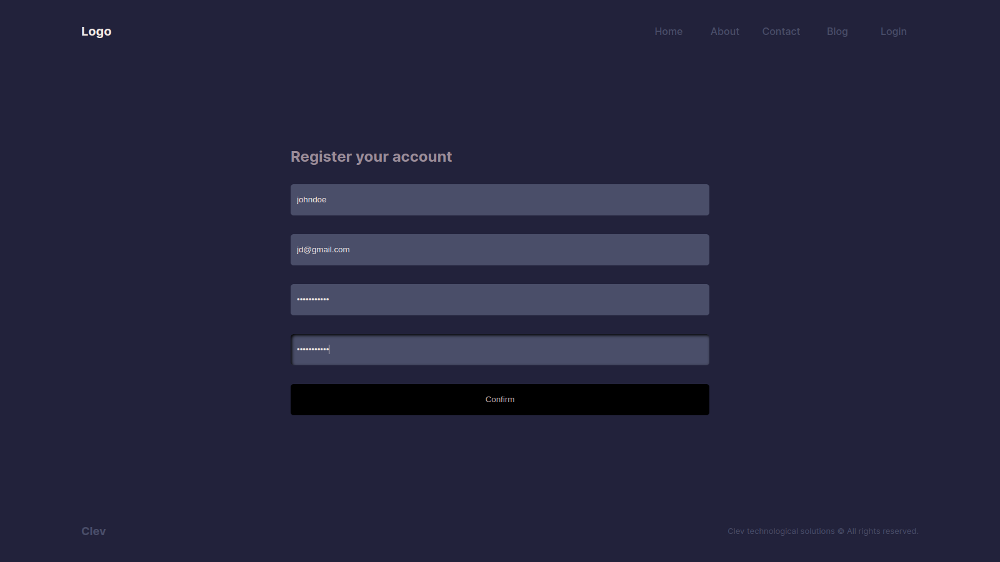

This is a landing page built with **NextJs 14**

## Getting Started

Running the development server
```bash
npm run dev
# or
yarn dev
# or
pnpm dev
# or
bun dev
```

Open [http://localhost:3000](http://localhost:3000) with your browser to see the result.

## Details

This is a full stack application using NextJs Route Handlers, Server Actions, MongoDB Atlas and NextAuth to build the backend.

## UI

#### Home page


### About page


## Contact page


## Login page


## Register page


## Blog page
:construction:

## Post page
:construction:
